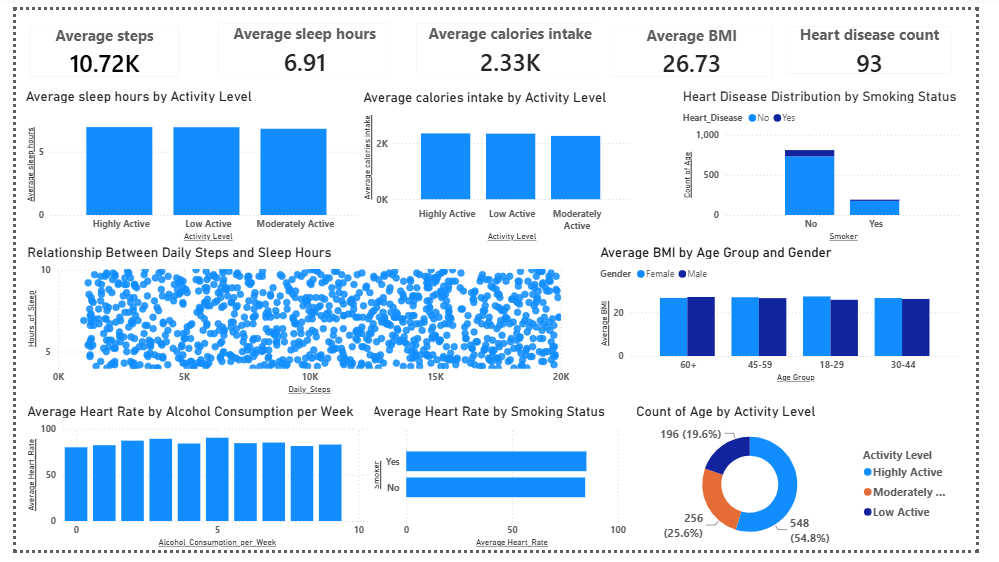

# VitaTrack Wellness – Health & Lifestyle Analytics Dashboard

## Business Question
VitaTrack Wellness, a digital health company, wanted to understand user 
lifestyle patterns and identify factors linked to heart disease risk, 
in order to improve lifestyle suggestions for users.

## Approach
- Analyzed user data covering Age, Gender, BMI, Steps, Calories, Sleep, 
  Heart Rate, Blood Pressure, Smoking, Alcohol, Exercise, Diabetic and 
  Heart Disease status
- Built a one-page Power BI dashboard with DAX measures to explore 
  activity levels, BMI trends, and smoking/alcohol impact
- Segmented users by activity level for targeted recommendations

## Key Findings
- Highly active users recorded higher average daily steps and similar 
  sleep duration compared to other groups, indicating better lifestyle habits
- Smokers showed a higher proportion of heart disease cases than non-smokers
- Steps vs. sleep hours showed only a weak relationship — activity alone 
  doesn't strongly predict sleep duration
- BMI varied across age and gender, with middle-aged and older users 
  showing higher average BMI
- Smokers showed a higher average heart rate than non-smokers, suggesting 
  cardiovascular stress linked to smoking

## Recommendations
- Encourage low-activity users toward walking/fitness programs
- Targeted awareness campaigns for smokers and frequent alcohol consumers
- Personalized diet/exercise guidance for higher-BMI age groups

## Tools
Power BI, DAX

